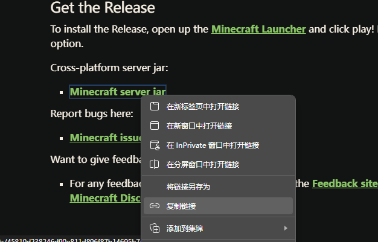

## 简介

通过 [itzg/docker-minecraft-server](https://github.com/itzg/docker-minecraft-server) 项目简单部署的纯净服务器（PAPER 核心）。这个项目主要是给人机群友一键部署+运行游戏用的。

## 部署步骤

确定你属于 `docker` 用户组

```bash
cd /home/.docker
mkdir ${CUSTOM_SERVER_NAME}-minecraft-server-${VERSION_NUMBER}/
cd ${CUSTOM_SERVER_NAME}-minecraft-server-${VERSION_NUMBER}/
git clone https://github.com/Astro-Aionia/mc_server_doc
docker compose up -d
```

如果遭遇报错

```
Faied to download mojang_${VERSION_NUMBER}.jar
```

从官网手动下载 server 包：

1. 访问官网对应版本发布页面 `https://www.minecraft.net/en-us/article/minecraft-java-edition-version`，如 [1.21.3 版本](https://www.minecraft.net/en-us/article/minecraft-java-edition-1-21-3)
2. 复制 `server.jar` 

   

3. 执行命令

```bash
cd minecraft_data/cache
wget -O ${COPYED_LINK} mojang_${VERSION_NUMBER}.jar
cd ..
docker compose up -d
```

查看运行状态

```bash
docker container ls
```

服务器正确运行时，容器的 `status` 应为 `running (healthy)` 状态。

## Client 配置

以 java 版 1.21.3 版本为例，需要 jdk 21。

### 安装 java

对于 Windows 用户，下载微软重构的 [OpenJDK 21](https://aka.ms/download-jdk/microsoft-jdk-21.0.5-windows-x64.msi)：

1. 双击 MSI 文件安装，典型的安装位置为
```
   C:\Program Files\Microsoft\jdk-21.0.4.7-hotspot
```

2. 添加到系统路径
	1. Windows 搜索系统环境变量并打开：

	   

	2. 通过新建添加如图所示变量，值为你真实的安装路径：

	   

	3. 在 Path 变量中添加 java 的可执行文件目录 `C:\Program Files\Microsoft\jdk-21.0.4.7-hotspot` 版本号根据你实际安装情况调整：

	   

	   

### 安装游戏

下载 [HMCL](https://github.com/HMCL-dev/HMCL/releases/download/release-3.6.11/HMCL-3.6.11.exe) 启动器，双击 EXE 打开。

主界面 - 设置，java 路径为自动选择


主界面 - 账户 - 离线模式 - 输入自己的名字，然后复制 UUID 保存


主界面 - 版本列表 - 添加游戏文件夹，选择一个合适的目录，新建 .minecraft 文件夹，将游戏数据保存于此


保存后安装新游戏，选 1.21.3 正式版，不要安装任何 API

## 联机设置

进入游戏添加服务器

```
IP:PORT
```
